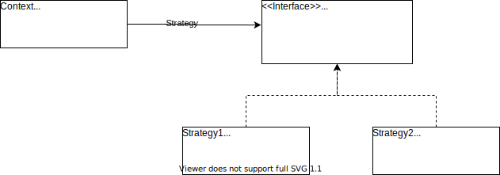

# Strategy Pattern

In computer programming, the strategy pattern (also known as the policy pattern) is a behavioral software design pattern that enables selecting an algorithm at runtime. Instead of implementing a single algorithm directly, code receives run-time instructions as to which in a family of algorithms to use.

In short: Instead of fixing 1 implementation, we can have abstract or interace for that, and decide on which implementation to choose at a later point in time.

